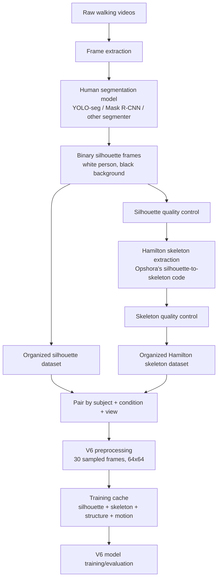

# Dataset Development Pipeline for Opshora's Gait Recognition System

This document explains how to build a new dataset that is compatible with the current V6 gait-recognition codebase.

The current best model is:

```text
designs/skeleton_silhouette_fusion_v6
```

It expects two paired datasets:

1. silhouette sequences;
2. Hamilton skeleton/topological sequences generated from the silhouettes.

The model then fuses both inputs:

```text
silhouette + Hamilton skeleton + skeleton structure blur + skeleton motion
```

At test time, the model does not classify subject IDs directly. It creates an embedding vector and compares distances:

```text
same person -> low distance
different person -> high distance
```

**This is no longer just a hypothetical guide** -- a real dataset was built
following exactly this blueprint: `datasets/CLoP-Gait` (raw video) ->
`datasets/CLoPGaitSilhouettes` / `datasets/CLoPGaitHamiltonSkeleton`
(processed), via `tools/dataset_pipeline/` (`manifest.py`, `segment.py`,
`skeleton.py`, `pipeline.py`, `qc.py`, `dataset_report.py`), retrained as
`designs/skeleton_silhouette_fusion_v6/clopgait_config.json`. Results and a
domain-generalization split example are in `runs/MODEL_COMPARISON.md`'s
"Tier C" section and `designs/skeleton_silhouette_fusion_v6/MODEL_ARCHITECTURE_AND_FLOW.md`
section 14.5. Where this document's advice below was revised because of
real lessons learned building that dataset, it says so explicitly.

## 1. Full pipeline overview



## 2. What data should be collected

For each person, collect multiple walking videos.

Recommended minimum:

| Item | Recommendation |
|---|---|
| Subjects | At least 30 for a small thesis prototype; 80+ is better. |
| Sequences per subject | At least 6 normal walking sequences. |
| Frames per sequence | Ideally 40-100 usable frames. |
| Views | At least one fixed side view; multiple views if possible. |
| Conditions | Normal walking first; optional bag/clothing/speed variations later. |
| Background | Prefer clean background, stable lighting, full body visible. |
| Consent | Required if collecting new human subject data. |

The model can technically run with fewer subjects, but contrastive learning needs repeated samples per identity. More subjects and more repeated walking conditions produce better embeddings.

## 3. Raw video organization

Keep raw videos separately from processed datasets.

Recommended raw structure:

```text
raw_videos/
  001/
    nm-01/
      090/
        video.mp4
    nm-02/
      090/
        video.mp4
  002/
    nm-01/
      090/
        video.mp4
```

Meaning:

| Field | Meaning |
|---|---|
| `001` | Subject ID. Use three digits. |
| `nm-01` | Walking condition and sequence number. |
| `090` | Camera view angle. Use three digits if possible. |

Recommended condition names:

| Condition prefix | Meaning |
|---|---|
| `nm` | Normal walking |
| `bg` | Walking with bag |
| `cl` | Clothing change |
| `fs` | Slow walking |
| `fq` | Fast walking |

Example:

```text
001/nm-01/090/video.mp4
001/bg-01/090/video.mp4
001/cl-01/090/video.mp4
```

## 4. Frame extraction

Convert each video into ordered image frames.

Recommended output:

```text
frames/
  001/
    nm-01/
      090/
        001-nm-01-090-000001.png
        001-nm-01-090-000002.png
        001-nm-01-090-000003.png
```

Rules:

1. Preserve frame order.
2. Use zero-padded frame numbers.
3. Keep only frames where the full body is visible.
4. Remove frames where the person is heavily occluded or outside the camera.

The current preprocessing uniformly samples `30` frames from every sequence, so each sequence should ideally have at least `30` good frames.

## 5. Human segmentation stage

Use a segmentation model to isolate the walking person from the background.

Possible choices:

| Option | Use case |
|---|---|
| YOLO segmentation model | Fast and practical for automatic person masks. |
| Mask R-CNN | Stronger classical instance segmentation option. |
| SAM-style segmentation | Useful if manual prompting/correction is acceptable. |
| Background subtraction | Only if the camera/background are very controlled. |

The output should be a binary silhouette:

```text
person = white / 255
background = black / 0
```

Do not save soft probability masks for the final silhouette dataset. Convert them into clean binary PNGs.

### Important segmentation rules

For each frame:

1. Detect all humans.
2. Keep the main walking subject.
3. If multiple people appear, choose the one that matches the previous frame track.
4. Fill small holes inside the body mask.
5. Remove small background blobs.
6. Save as PNG, not JPG.

JPG compression can create gray artifacts around the silhouette. PNG is safer.

### Segmentation resolution and storage margin

Two lessons from actually building a real custom dataset this way
(`tools/dataset_pipeline/`, backing `datasets/CLoP-Gait`):

- **Tune the segmentation model's inference resolution up for high-res
  source video.** Ultralytics YOLO returns masks already hard-binarized at
  a resolution tied to its `imgsz` argument (default 640), which is coarse
  for 1080p+ source footage -- on real CLoP-Gait footage this produced
  visibly blocky limb edges (e.g. a squared-off notch at the shoulder/arm).
  Raising `imgsz` to 1280 gave a clearly cleaner mask (proper tapered
  limbs, separated feet) for roughly 3x the per-frame YOLO cost. See
  `tools/dataset_pipeline/segment.py`'s `DEFAULT_IMGSZ`.
- **Store silhouettes with natural margin, not tight-cropped to the
  subject's bounding box.** It's tempting to normalize each stored frame to
  fill the canvas (bbox + a couple px margin) since that's what the model
  sees at training time -- but that tight crop already happens automatically
  at training-cache-build time (`gait.preprocessing.clean_and_align`), so
  baking it into storage too just makes the raw dataset harder to visually
  QC (everything looks maximally zoomed-in and cropped) for no benefit.
  Store with the subject occupying roughly 40-50% of the canvas height
  instead (`tools/dataset_pipeline/segment.py`'s `crop_with_margin()`,
  `fill_ratio` default 0.45) -- this also matches how CASIA-B's own raw
  `GaitDatasetB-silh` is stored (person occupies well under half the frame).

## 6. Silhouette output structure

The silhouette dataset must follow this folder structure:

```text
datasets/OpshoraSilhouettes/
  001/
    nm-01/
      090/
        001-nm-01-090-000001.png
        001-nm-01-090-000002.png
        ...
  002/
    nm-01/
      090/
        002-nm-01-090-000001.png
```

The code expects each image path to contain:

```text
subject / condition / view / frame.png
```

The subject must be a three-digit ID:

```text
001, 002, 003, ...
```

The view should preferably also be three digits:

```text
000, 018, 090, 180
```

If there is only one camera view, use:

```text
090
```

or any consistent three-digit label.

## 7. Hamilton skeleton generation stage

After silhouettes are created, run Opshora's silhouette-to-skeleton code.

Input:

```text
datasets/OpshoraSilhouettes/
```

Output:

```text
datasets/OpshoraHamiltonSkeleton/
```

The skeleton output should use the same subject/condition/view/frame structure:

```text
datasets/OpshoraHamiltonSkeleton/
  001/
    nm-01/
      090/
        001-nm-01-090-000001_skeleton.png
        001-nm-01-090-000002_skeleton.png
        ...
```

The skeleton image should be:

```text
skeleton = white / 255
background = black / 0
```

The current model does not need the skeleton frame filename to exactly match the silhouette frame filename, but the frames must remain in the correct chronological order.

### Critical: keep the skeleton co-registered with its silhouette, and don't let thin lines get resized away

This is the single most important lesson from actually building CLoP-Gait's
skeleton dataset, and it silently produced a broken (but not
crashing/error-free) result the first time around.

A skeleton is a **1-pixel-wide** structure. If the skeleton PNGs are stored
at a higher resolution than the model's training canvas (64x64) -- e.g.
CLoP-Gait stores them at 320x240 for easier visual QC -- naively resizing
each skeleton frame down to 64x64 with plain nearest-neighbor point-sampling
is close to worst-case for a thin line: on a real sample this dropped 650
skeleton pixels down to just 31 survivors, which looks like scattered noise
dots instead of a body-shaped skeleton once you preview it. On top of that,
if the skeleton and its paired silhouette are each cropped/rescaled to the
training canvas *independently* (own bounding box, own scale factor), the
two channels can end up describing slightly different crops of the same
frame -- they stop being spatially aligned.

The fix implemented in `gait/preprocessing.py`'s
`process_skeleton_silhouette_sequence()`: the skeleton reuses the *exact*
crop transform computed from its paired silhouette
(`compute_crop_transform`/`apply_crop_transform`), so both channels are
guaranteed to describe the same crop, and downsamples via an "any-coverage"
rule (a destination pixel counts as skeleton if the source region has *any*
skeleton coverage, not a majority) followed by re-running
`topology_preserving_thinning()` so the result is a genuine 1px skeleton
again rather than vanishing or turning into a blob. This already runs
automatically for any dataset whose stored skeleton resolution doesn't
already match the training canvas -- you don't need to do anything extra in
your own dataset pipeline, but you should know it's there, and if you write
a from-scratch skeleton generator, apply the same principle: crop/scale
the skeleton exactly like its silhouette, and never resize a thin binary
structure with plain nearest-neighbor/majority-vote downsampling. If your
skeleton PNGs are already pre-rendered at exactly 64x64 (CASIA-B's
`CASIA_B_Hamilton_Skeleton` convention), none of this applies -- that
resize branch is skipped entirely when the shape already matches.

## 8. Pairing rule for V6

V6 pairs silhouette and skeleton sequences using:

```text
subject + condition + view
```

So these two folders are paired:

```text
datasets/OpshoraSilhouettes/001/nm-01/090/
datasets/OpshoraHamiltonSkeleton/001/nm-01/090/
```

These are not paired:

```text
datasets/OpshoraSilhouettes/001/nm-01/090/
datasets/OpshoraHamiltonSkeleton/001/nm-02/090/
```

because the condition is different.

The number of frames can differ slightly, because preprocessing uniformly samples `30` frames from each sequence independently. But the best practice is to generate skeletons from the exact same silhouette frames.

## 9. Quality-control checklist

Before training, visually inspect random samples.

### Silhouette QC

Check that:

- the full body is visible;
- the subject is centered enough;
- the mask is mostly clean;
- left/right legs are not completely merged in every frame;
- there are no large background blobs;
- frames are in correct walking order;
- no unrelated people are included.

### Skeleton QC

Check that:

- the skeleton lies inside the body silhouette;
- the skeleton is connected enough;
- the main torso/leg structure is visible;
- skeletons are not empty or mostly noise;
- frame order is preserved;
- motion changes smoothly over time.

Bad silhouettes create bad skeletons. If skeleton quality is poor, fix the silhouette step first.

## 10. Dataset validation before training

A valid sequence should have:

```text
subject: three digits
condition: string such as nm-01
view: three digits such as 090
frames: preferably >= 30
```

A valid paired dataset should have matching keys:

```text
(subject, condition, view)
```

for both silhouette and skeleton datasets.

Example expected pair:

```text
silhouette key: 001 / nm-01 / 090
skeleton key:   001 / nm-01 / 090
```

If a skeleton sequence has no matching silhouette sequence, V6 will skip it and count it as a missing pair.

For a clean dataset, aim for:

```text
missing_pairs = 0
```

## 11. How the current code will convert the dataset

When using:

```json
"dataset_format": "skeleton_silhouette_fusion"
```

the preprocessing code creates four channels:

| Channel | Created from | Meaning |
|---|---|---|
| 0 | silhouette frame | cleaned/aligned body mask |
| 1 | skeleton frame | binary Hamilton skeleton |
| 2 | skeleton frame | blurred skeleton structure |
| 3 | skeleton frame sequence | temporal skeleton motion |

The model receives:

```text
silhouette = channel 0
topology   = channels 1, 2, 3
```

Then it trains the V6 two-stream model.

## 12. How to configure a custom dataset run

Create a new design or duplicate the V6 config.

Example:

```text
designs/opshora_custom_v1/
  config.json
  model.py
  README.md
```

The simplest approach is to copy the V6 design:

```text
designs/skeleton_silhouette_fusion_v6/
```

and change only the dataset paths/cache/run settings.

Example local/custom config values:

```json
{
  "dataset_name": "opshora_custom_fusion",
  "dataset_format": "skeleton_silhouette_fusion",
  "dataset_path": "/data/OpshoraHamiltonSkeleton.zip",
  "silhouette_dataset_path": "/data/OpshoraSilhouettes.zip",
  "cache_dir": "/data/processed/opshora_custom_fusion_v1",
  "height": 64,
  "width": 64,
  "sequence_length": 30,
  "train_subjects": 70
}
```

Important:

```json
"train_subjects": 70
```

means the first 70 sorted subject IDs are used for training, and the remaining subjects are used for testing.

If the custom dataset has only 30 subjects, use something like:

```json
"train_subjects": 20
```

so at least 10 subjects remain unseen for testing.

### Alternative split: domain generalization instead of identity holdout

`train_subjects` above implements an identity-holdout split (unseen
*people*). If your dataset instead has multiple distinct **domains** per
subject (e.g. indoor/outdoor, day/night -- the same people recorded in
different environments), you may want to test generalization to an unseen
*environment* for known people instead. `gait.dataset.GaitSequenceDataset`
supports this via two extra config fields:

```json
{
  "split_mode": "domain",
  "test_domain_suffix": "od"
}
```

With `split_mode: "domain"`, every subject's sequences whose `condition`
string ends in `test_domain_suffix` (e.g. `nm-01-od`) become the entire
test/probe set, and every other sequence (all domains except that one)
becomes training data -- all subjects appear in both splits. This only
makes sense if your condition-naming convention encodes the domain as a
suffix (see CLoP-Gait's own `id`/`od`/`on` convention in
`tools/dataset_pipeline/manifest.py`'s `DOMAIN_SUFFIX`). Leave `split_mode`
unset (defaults to `"subject"`) for the standard identity-holdout protocol.
Real example: `designs/skeleton_silhouette_fusion_v6/clopgait_config.json`
and `runs/MODEL_COMPARISON.md`'s "Tier C" section.

## 13. Modal upload procedure

Zip both processed datasets:

```bash
zip -r OpshoraSilhouettes.zip datasets/OpshoraSilhouettes
zip -r OpshoraHamiltonSkeleton.zip datasets/OpshoraHamiltonSkeleton
```

**Don't skip this step, even if you'd rather upload the folder directly --
it matters for more than convenience.** Modal Volumes are network-mounted;
uploading a dataset as a raw directory of many small files (a real
CLoP-Gait silhouette dataset had ~11,600 individual PNGs) makes the
training job's own dataset-indexing step read every file as a separate
round trip over that mount, which can look like the job is hung for many
minutes even though nothing is actually wrong. A single zip archive is read
sequentially in one pass and indexes in seconds. If a run looks stuck at a
line like `Indexing paired silhouette dataset: ...`, check whether that
dataset was uploaded as a raw directory instead of a zip.

Upload to Modal volume:

```bash
modal volume put gait-datasets-store OpshoraSilhouettes.zip /OpshoraSilhouettes.zip
modal volume put gait-datasets-store OpshoraHamiltonSkeleton.zip /OpshoraHamiltonSkeleton.zip
```

Then update config paths:

```json
"dataset_path": "/data/OpshoraHamiltonSkeleton.zip",
"silhouette_dataset_path": "/data/OpshoraSilhouettes.zip"
```

Deploy and train:

```bash
modal deploy modal_app.py
python submit_modal.py run --design opshora_custom_v1 --run custom_fusion_001
```

## 14. Recommended development phases

### Phase 1: Small sanity dataset

Use:

```text
5 subjects
2 sequences per subject
1 view
normal walking only
```

Goal:

- confirm segmentation works;
- confirm skeleton conversion works;
- confirm folder structure is valid;
- confirm preprocessing creates a cache;
- confirm model can run without crashing.

Do not judge accuracy from this phase.

### Phase 2: Prototype thesis dataset

Use:

```text
20-30 subjects
4-6 sequences per subject
1-2 views
normal walking
```

Goal:

- verify same-person distances become lower than different-person distances;
- check if verification AUC rises above random;
- inspect silhouette/skeleton quality.

### Phase 3: Stronger dataset

Use:

```text
50+ subjects
6+ sequences per subject
multiple conditions/views if possible
```

Goal:

- train a more defensible model;
- report Rank-1, Rank-5, verification AUC, distance gap;
- compare skeleton-only vs silhouette-fusion.

## 15. Common failure cases

| Problem | Likely cause | Fix |
|---|---|---|
| `No image sequences found` | Wrong folder/zip structure | Ensure paths contain `subject/condition/view/frame.png`. |
| Many missing pairs | Skeleton and silhouette keys do not match | Use identical subject, condition, and view folders. |
| Empty skeletons | Bad silhouette or skeleton extraction threshold | Fix segmentation and skeleton extraction. |
| Model overfits quickly | Too few subjects | Add more identities or use stronger train/test split. |
| Rank-1 low but AUC high | Embeddings verify pairs but strict retrieval is hard | Use more gallery samples, improve dataset size/quality. |
| Same/different distances overlap | Segmentation/skeleton quality poor or dataset too small | Improve masks, collect more varied samples. |

## 16. What to save for the thesis

Save evidence at each stage:

```text
raw video sample
extracted frame sample
segmentation mask sample
cleaned silhouette sample
Hamilton skeleton sample
V6 preprocessing preview
training curves
distance histogram
ROC curve
Rank-1/Rank-5 metrics
same_distance/different_distance table
```

This lets Opshora explain the full pipeline from data collection to final contrastive gait verification.

## 17. Final recommended dataset format

Use this as the target final structure:

```text
datasets/
  OpshoraSilhouettes/
    001/
      nm-01/
        090/
          001-nm-01-090-000001.png
          001-nm-01-090-000002.png
    002/
      nm-01/
        090/
          002-nm-01-090-000001.png

  OpshoraHamiltonSkeleton/
    001/
      nm-01/
        090/
          001-nm-01-090-000001_skeleton.png
          001-nm-01-090-000002_skeleton.png
    002/
      nm-01/
        090/
          002-nm-01-090-000001_skeleton.png
```

If this structure is followed, the current V6 preprocessing and training code can use the dataset with minimal changes.

