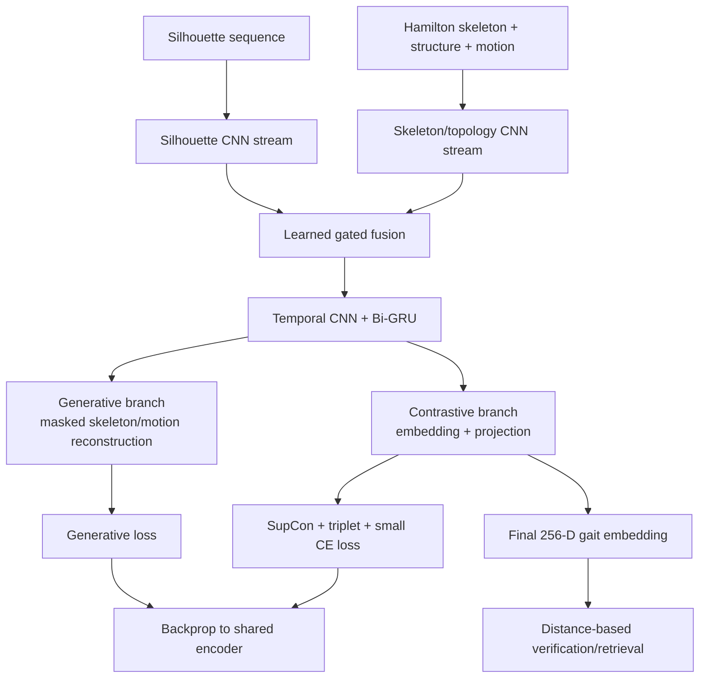
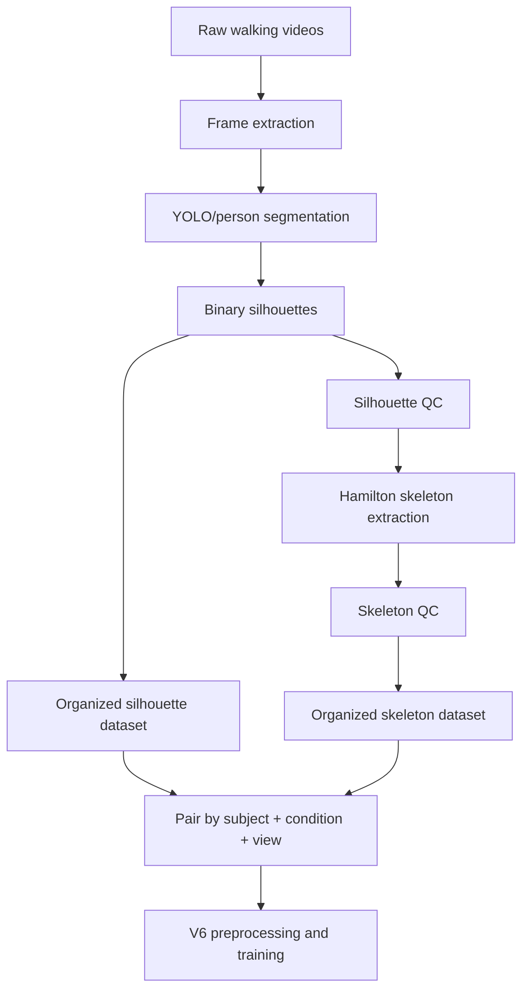

# Opshora Thesis Context

This is the single current context file for the thesis project. Older notes about V1/V2/V3 were useful during exploration, but the current main working system is the V6 skeleton-silhouette fusion model.

## 1. Thesis focus

The project studies gait recognition using a custom topological skeleton representation derived from silhouettes. The central idea is:

> Use Hamilton/Hamilton-Jacobi-style medial-axis skeleton maps to represent body topology and motion, then learn a generative + contrastive embedding where same-person gait sequences are close and different-person gait sequences are far apart.

The current implementation is not a closed-set ID classifier at test time. It is a distance-based verification/retrieval system.

## 2. Thesis objectives and current status

| Objective | Current status | Evidence |
|---|---|---|
| Construct/use a gait dataset with meaningful condition variation | Partially fulfilled | CASIA-B paired silhouette + Hamilton skeleton data is working. A future custom Opshora dataset is still needed for true indoor/outdoor day/night cross-domain claims. |
| Design a generative + contrastive learning framework | Fulfilled as a working prototype | V6 uses masked reconstruction plus supervised contrastive/triplet metric learning on a shared encoder. |
| Evaluate the model with suitable metrics and comparison evidence | Partially fulfilled | V6 has Rank-k, ROC-AUC, distance gap, EER, condition-wise evaluation, plots, and local checkpoint evaluation. Formal comparison to external papers/baselines is still future work. |

Safe thesis claim:

```text
A working generative-contrastive Hamilton skeleton and silhouette fusion gait framework was implemented and evaluated on unseen CASIA-B subjects. The learned embedding separates same-subject and different-subject gait sequences with strong verification AUC.
```

Do not claim yet:

```text
The system is state-of-the-art.
The full custom cross-domain dataset is complete.
The model is fully robust to all indoor/outdoor, day/night, and clothing changes.
```

## 3. Current best model: V6

Main design:

```text
designs/skeleton_silhouette_fusion_v6/
```

Architecture documentation:

```text
designs/skeleton_silhouette_fusion_v6/MODEL_ARCHITECTURE_AND_FLOW.md
```

Current best downloaded run:

```text
runs/fusion_rank1_002/
```

Checkpoint used for local Rank-1 evaluation:

```text
runs/fusion_rank1_002/best_rank1_model.pt
```

## 4. V6 input representation

V6 uses paired CASIA-B data:

```text
datasets/CASIA_B_Hamilton_Skeleton/
datasets/GaitDatasetB-silh/
```

The preprocessing pairs sequences by:

```text
subject + condition + view
```

Each sequence is converted into 30 frames at 64x64 resolution with four channels:

| Channel | Meaning |
|---|---|
| 0 | cleaned silhouette |
| 1 | binary Hamilton skeleton |
| 2 | blurred skeleton structure |
| 3 | temporal skeleton motion |

The model receives:

```text
silhouette = channel 0
topology   = channels 1, 2, 3
```

## 5. V6 architecture summary



Important implementation details:

- two spatial streams: silhouette stream and skeleton/topology stream;
- learned gate decides how much to use each stream per frame;
- temporal CNN captures local walking transitions;
- Bi-GRU captures sequence-level gait dynamics;
- decoder reconstructs masked skeleton and motion frames;
- contrastive projection learns same/different subject separation;
- test-time output is a 256-dimensional embedding.

## 6. Loss design

Generative/self-supervised loss:

```text
weighted skeleton BCE + Dice loss + SmoothL1 motion loss
```

Recognition/metric loss:

```text
supervised contrastive loss + batch-hard triplet loss + small auxiliary CE loss
```

The CE classifier is training-only. Final testing uses embedding distances, not predicted subject IDs.

Closed-loop requirement:

```text
generative loss -> shared encoder
contrastive/triplet loss -> shared encoder
```

So the architecture satisfies the advisor’s requested dual-stage feedback mechanism while avoiding unstable full GAN training.

## 7. Current dataset/evaluation protocol

Prepared fused dataset:

```text
Total subjects:   124
Total sequences:  2964
Missing pairs:    0
Sequence length:  30 frames
Resolution:       64 x 64
```

Subject-disjoint split:

```text
Train subjects: 001-074
Test subjects:  075-124
```

Counts:

```text
Train subjects:  74
Test subjects:   50
Train sequences: 1767
Test sequences:  1197
```

Current limitation:

```text
There is no separate validation split in this completed run. Early stopping also monitored the unseen evaluation split.
```

For a stricter final thesis protocol, use subject-disjoint train/validation/test splits.

## 8. Current best metrics

From local evaluation of:

```text
runs/fusion_rank1_002/best_rank1_model.pt
```

Main results:

```text
3-gallery Rank-1:                61.99%
Rank-5:                          89.40%
Rank-10:                         95.13%
Verification AUC:                90.25%
Balanced verification accuracy:  82.62%
EER estimate:                    17.43%
same_distance:                   0.3158
different_distance:              0.8748
distance_gap:                    0.5591
```

Condition-wise retrieval:

| Condition | Probes | Rank-1 | Rank-5 | Rank-10 |
|---|---:|---:|---:|---:|
| Normal walking | 747 | 72.96% | 96.52% | 99.33% |
| Clothing change | 300 | 34.67% | 71.67% | 84.67% |

Interpretation:

The model works well for normal walking and verification, but clothing-change sequences remain much harder. This is a good limitation/future-work discussion point.

## 9. Generated evidence files

Main post-training report:

```text
runs/fusion_rank1_002/post_training_analysis/POST_TRAINING_REPORT.md
```

Important figures:

```text
runs/fusion_rank1_002/post_training_analysis/01_losses.png
runs/fusion_rank1_002/post_training_analysis/02_retrieval_rank.png
runs/fusion_rank1_002/post_training_analysis/03_verification.png
runs/fusion_rank1_002/post_training_analysis/04_distances.png
runs/fusion_rank1_002/post_training_analysis/07_distance_histogram.png
runs/fusion_rank1_002/post_training_analysis/08_roc_curve.png
runs/fusion_rank1_002/post_training_analysis/09_cmc_curve.png
runs/fusion_rank1_002/post_training_analysis/10_embedding_pca_subjects.png
```

## 10. Modal workflow

Deploy after code/config changes:

```bash
modal deploy modal_app.py
```

Run the current best design:

```bash
python submit_modal.py run --design skeleton_silhouette_fusion_v6 --run fusion_rank1_003
```

Downloaded Modal artifacts should be placed under:

```text
runs/<run_name>/
```

## 11. Local post-training evaluation

Use the conda `ML` environment:

```bash
/Users/rahi/miniconda3/envs/ML/bin/python tools/post_training_analysis.py \
  --run-dir runs/fusion_rank1_002 \
  --checkpoint runs/fusion_rank1_002/best_rank1_model.pt \
  --skeleton-dataset datasets/CASIA_B_Hamilton_Skeleton \
  --silhouette-dataset datasets/GaitDatasetB-silh \
  --cache-dir runs/fusion_rank1_002/local_processed_cache_full \
  --gallery-per-subject 3
```

The preprocessing reader supports subject `.tar.gz` archives inside the silhouette dataset folder, so every subject archive does not need to be manually extracted.

Device selection in the script:

```text
CUDA -> MPS -> CPU
```

In the latest local run, MPS was built but not available, so evaluation used CPU.

## 12. Future custom dataset pipeline

For Opshora’s own dataset:



Recommended folder structure:

```text
datasets/OpshoraSilhouettes/
  001/nm-01/090/frame_000001.png
  001/nm-02/090/frame_000001.png

datasets/OpshoraHamiltonSkeleton/
  001/nm-01/090/frame_000001_skeleton.png
  001/nm-02/090/frame_000001_skeleton.png
```

Rules:

- use three-digit subject IDs: `001`, `002`, ...
- use condition names such as `nm-01`, `cl-01`, `bg-01`;
- use view folders such as `000`, `090`, `180`;
- save binary silhouettes and skeletons as PNG;
- keep subject/condition/view identical between silhouette and skeleton folders;
- aim for at least 30 good frames per sequence.

Minimum prototype:

```text
5 subjects, 2 sequences each, 1 view, normal walking only
```

Better thesis dataset:

```text
30+ subjects, 4-6 sequences per subject, normal + clothing/condition variation
```

Best final cross-domain dataset:

```text
50+ subjects with indoor/outdoor, day/night, clothing variation, and multiple views
```

## 13. Remaining work

Most useful next steps:

1. Add exact training-time logging.
2. Add exact GPU peak memory logging on Modal.
3. Run a silhouette-only baseline.
4. Run a skeleton-only/no-generative ablation.
5. Create a separate validation split for final thesis protocol.
6. Test on Opshora’s custom dataset when available.
7. Report comparison table against baselines/existing work.

