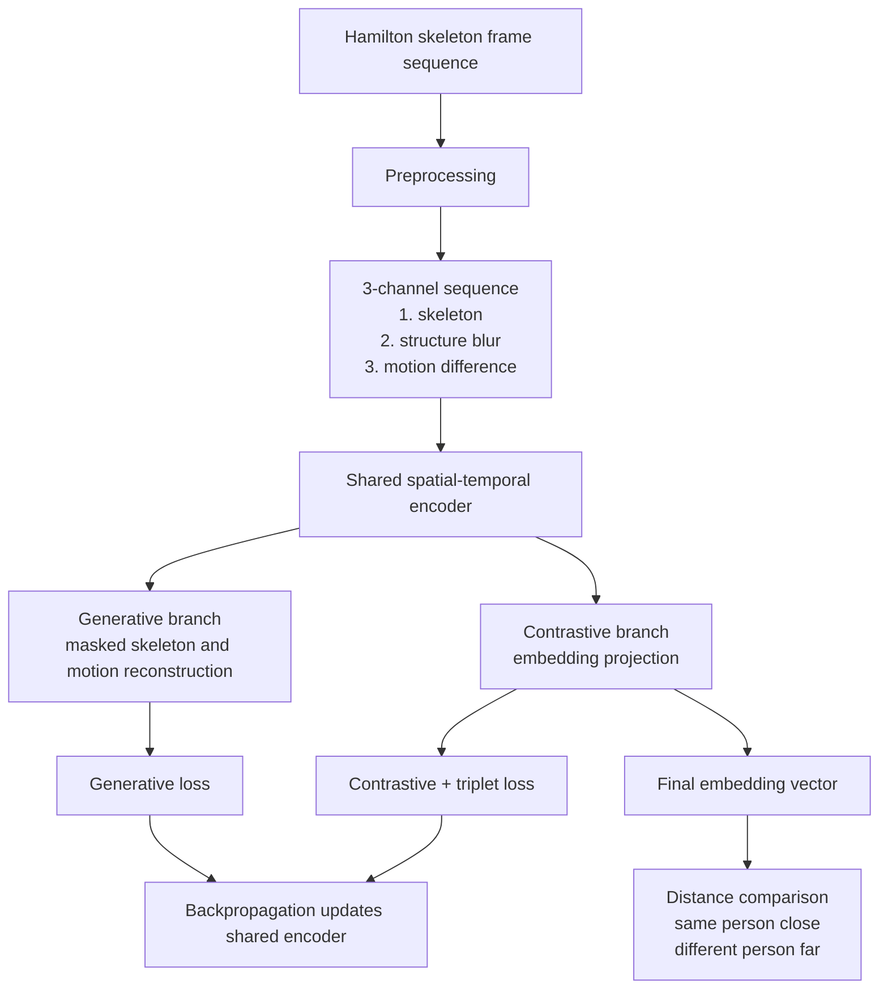
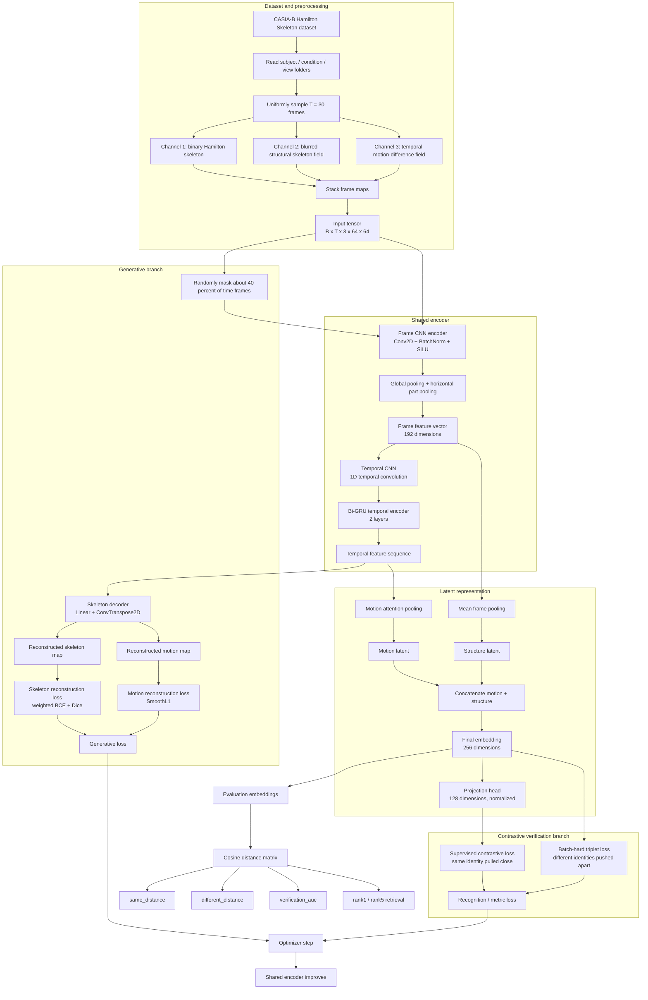
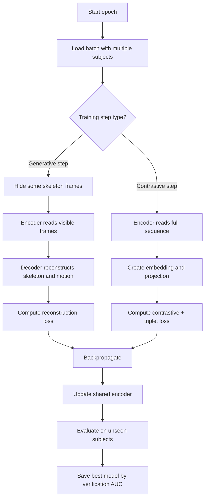

# Skeleton Contrastive V3: Model Architecture and Flow

This document explains the model architecture, preprocessing flow, training flow, losses, and final output of the current `skeleton_contrastive_v3` system.

The goal of this model is not closed-set subject-ID classification. The goal is blind gait verification:

> If two unseen gait sequences are passed through the model, the embedding distance should be low for the same person and high for different people.

## 1. Simple architecture diagram



## 2. Detailed architecture diagram



## 3. What input is used

The V3 model uses the Hamilton skeleton dataset:

```text
datasets/CASIA_B_Hamilton_Skeleton/
```

Each sequence has many skeleton frame images, arranged by:

```text
subject / condition / view / frame_skeleton.png
```

The model does not use RGB video directly. It uses precomputed Hamilton skeleton images.

## 4. Preprocessing flow

For every walking sequence:

1. Read all skeleton frames.
2. Uniformly sample `T = 30` frames.
3. Resize or keep each frame at `64 x 64`.
4. Convert each frame into three maps:

| Channel | Name | Meaning |
|---|---|---|
| 1 | Skeleton map | Binary Hamilton skeleton. White pixels show the medial-axis body skeleton. |
| 2 | Structure blur map | A softly blurred skeleton map. It helps the CNN learn spatial body structure more smoothly. |
| 3 | Motion difference map | Difference between the current skeleton and the previous sampled frame. It highlights movement. |

So each sequence becomes:

```text
30 frames x 3 channels x 64 height x 64 width
```

In tensor notation:

```text
B x T x C x H x W
= batch x 30 x 3 x 64 x 64
```

## 5. Model components

### 5.1 Frame CNN encoder

Each frame has three channels:

```text
skeleton + structure blur + motion difference
```

The frame encoder applies convolution layers:

```text
Conv2D -> BatchNorm -> SiLU
Conv2D -> BatchNorm -> SiLU
Conv2D -> BatchNorm -> SiLU
Conv2D -> BatchNorm -> SiLU
```

Then it performs two kinds of pooling:

1. Global pooling: captures whole-body information.
2. Horizontal part pooling: captures rough body-part regions such as upper/middle/lower body.

This produces a per-frame feature vector of size `192`.

### 5.2 Temporal CNN

The temporal CNN reads the frame feature sequence and learns short-term motion patterns.

Example:

```text
frame 1 -> frame 2 -> frame 3
```

This helps the model understand local walking transitions.

### 5.3 Bi-GRU temporal encoder

After temporal convolution, a bidirectional GRU reads the full sequence.

It looks both forward and backward in time:

```text
past -> current -> future
future -> current -> past
```

This gives the model a stronger understanding of the walking cycle.

### 5.4 Motion latent

The model uses attention pooling over the temporal features.

This means the model learns which frames are more important for identifying gait motion.

Output:

```text
motion_latent
```

### 5.5 Structure latent

The model also averages the frame-level spatial features.

This captures the general skeleton/body structure.

Output:

```text
structure_latent
```

### 5.6 Final embedding

The model concatenates:

```text
motion_latent + structure_latent
```

Then it maps them into a final embedding vector:

```text
embedding_dim = 256
```

This embedding is the final gait representation.

## 6. Generative branch

The generative branch is used during training.

It randomly hides some frames:

```text
mask_ratio = 0.4
```

So around 40% of the time frames are hidden.

The model must reconstruct:

1. The missing skeleton map.
2. The missing motion-difference map.

This forces the encoder to learn temporal gait patterns instead of memorizing static shape only.

### Generative target

```text
target 1 = skeleton map
target 2 = motion map
```

### Generative output

```text
reconstructed skeleton
reconstructed motion
```

### Generative loss

The reconstruction loss has three parts:

```text
skeleton BCE loss
Skeleton Dice loss
motion SmoothL1 loss
```

In easy words:

- BCE helps predict white skeleton pixels correctly.
- Dice loss helps with thin/sparse skeleton shapes.
- SmoothL1 helps reconstruct the motion-change map.

## 7. Contrastive branch

The contrastive branch is responsible for verification.

It creates a normalized projection vector:

```text
projection_dim = 128
```

Then it applies metric-learning losses:

1. Supervised contrastive loss.
2. Batch-hard triplet loss.

### Positive pairs

Same subject:

```text
subject 001 nm-01 view 000
subject 001 cl-01 view 090
```

These should be pulled close together.

### Negative pairs

Different subjects:

```text
subject 001
subject 027
```

These should be pushed far apart.

## 8. Why there is no subject-ID classifier in V3

In V3:

```json
"lambda_ce": 0.0
```

That means the model is not optimized as a normal subject-ID classifier.

Instead, it learns an embedding space.

At test time:

```text
input sequence -> embedding vector -> compare distance
```

If two embeddings are close, the model treats them as likely same person.

If two embeddings are far apart, the model treats them as different people.

This matches the thesis requirement for blind cross-view verification.

## 9. Training flow in easy words



The important part:

> Both losses update the same shared encoder.

So the encoder learns from:

```text
generative reconstruction
+ contrastive distance separation
```

## 10. Evaluation flow

During evaluation:

1. The model receives unseen test sequences.
2. It outputs one embedding per sequence.
3. Embeddings are normalized.
4. Distances are computed between embeddings.
5. Metrics are calculated.

Important metrics:

| Metric | Meaning |
|---|---|
| `same_distance` | Average distance between sequences of the same person. Lower is better. |
| `different_distance` | Average distance between different people. Higher is better. |
| `distance_gap` | Difference between different-person and same-person distance. Higher is better. |
| `verification_auc` | Probability that same-person pairs are closer than different-person pairs. Higher is better. |
| `rank1` | Whether the closest gallery subject is correct. Higher is better. |
| `rank5` | Whether the correct subject is in the top 5 matches. Higher is better. |

## 11. Current result summary

The current V3 run achieved approximately:

```text
best verification AUC = 0.889
same-person distance  = 0.28
different distance    = 0.84
distance gap          = 0.56
rank1                 = 0.46
rank5                 = 0.74
```

Interpretation:

- The model separates same-person and different-person pairs well.
- It is stronger as a verification model than as a strict ID retrieval model.
- The result supports the generative-contrastive embedding idea.
- Rank-1 still needs improvement for stronger identification performance.

## 12. Pseudo-code version

```python
# 1. Preprocess skeleton sequence
frames = read_skeleton_frames(sequence)
frames = uniform_sample(frames, length=30)

for each frame:
    skeleton = binary_skeleton(frame)
    structure = gaussian_blur(skeleton)
    motion = abs(skeleton - previous_skeleton)

input_sequence = stack([skeleton, structure, motion])


# 2. Forward pass
frame_features = CNN(input_sequence)
temporal_features = TemporalCNN(frame_features)
temporal_features = BiGRU(temporal_features)

motion_latent = attention_pool(temporal_features)
structure_latent = average_pool(frame_features)

embedding = fuse(motion_latent, structure_latent)
projection = normalize(Projector(embedding))


# 3. Generative training step
masked_input = mask_some_time_frames(input_sequence)
reconstruction = Decoder(temporal_features)

loss_gen = skeleton_BCE(reconstruction, target_skeleton)
         + dice_loss(reconstruction, target_skeleton)
         + motion_loss(reconstruction, target_motion)


# 4. Contrastive training step
loss_contrast = supervised_contrastive_loss(projection, subject_labels)
loss_triplet = batch_hard_triplet_loss(embedding, subject_labels)


# 5. Total learning effect
loss_gen updates shared encoder
loss_contrast + loss_triplet updates shared encoder


# 6. Testing
embedding_a = model(sequence_a)
embedding_b = model(sequence_b)
distance = cosine_distance(embedding_a, embedding_b)

if distance is small:
    prediction = "same person"
else:
    prediction = "different person"
```

## 13. One-paragraph explanation for presentation

The proposed model uses Hamilton skeleton sequences as input instead of raw RGB frames. Each sequence is converted into three maps: a binary skeleton map, a blurred structure map, and a motion-difference map. A shared spatial-temporal encoder first extracts frame-level skeleton features using convolution layers, then learns walking dynamics using temporal convolution and a bidirectional GRU. The model has two training branches. The generative branch masks part of the sequence and reconstructs the missing skeleton and motion maps, forcing the encoder to learn temporal gait structure. The contrastive branch projects the same embedding into a metric space where sequences from the same person are pulled close and different people are pushed apart. During testing, the model does not predict a fixed subject ID. Instead, it compares embedding distances for blind person verification.

## 14. What was used in the model

| Component | Used in V3 |
|---|---|
| Input type | Hamilton skeleton image sequence |
| Sequence length | 30 frames |
| Image size | 64 x 64 |
| Input channels | skeleton, structure blur, motion difference |
| Spatial encoder | CNN with BatchNorm and SiLU |
| Body-part cue | Horizontal part pooling |
| Temporal encoder | Temporal CNN + bidirectional GRU |
| Latent features | motion latent + structure latent |
| Generative decoder | ConvTranspose2D decoder |
| Generative target | skeleton map + motion map |
| Contrastive learning | supervised contrastive loss |
| Metric learning | batch-hard triplet loss |
| Subject-ID classifier | disabled in V3 |
| Test output | embedding vector |
| Final decision | distance-based verification |
| Early stopping metric | verification AUC |

