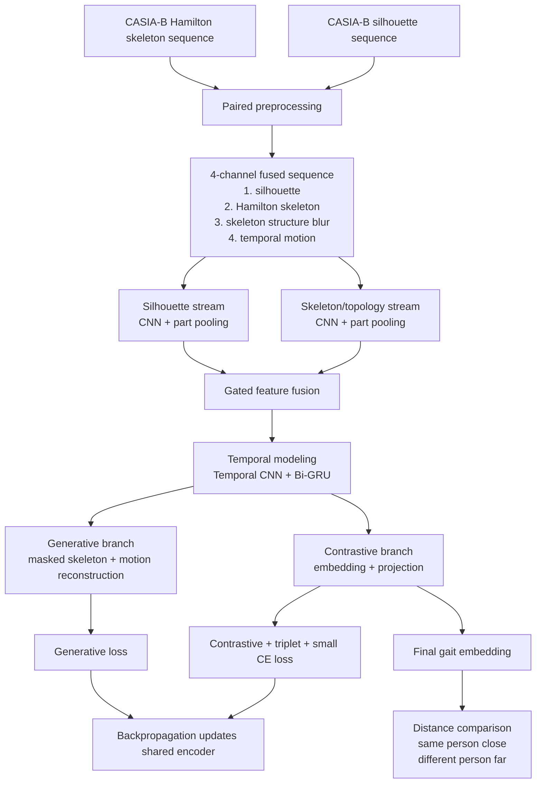
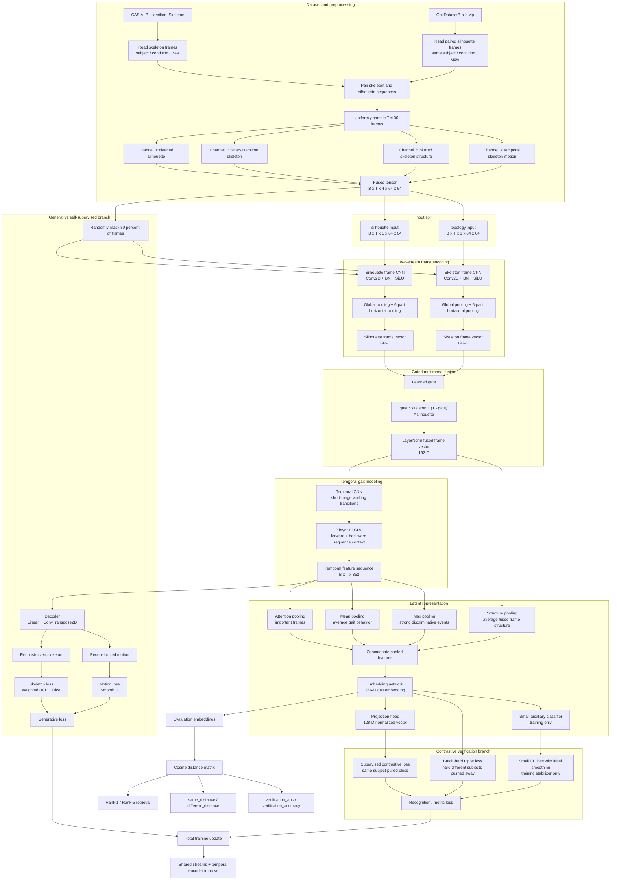
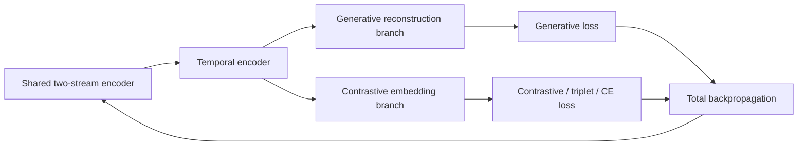

# Skeleton + Silhouette Fusion V6: Model Architecture and Flow

This document explains the architecture, preprocessing pipeline, training flow, loss design, evaluation method, and final interpretation of the `skeleton_silhouette_fusion_v6` model.

V6 is the strongest current design in this codebase. It was created after the skeleton-only models showed good verification behavior but limited strict Rank-1 retrieval. The main idea is:

> Hamilton skeleton maps provide motion and topology, while silhouettes provide body-shape/context cues. The V6 model fuses both so the embedding can support blind gait verification and better retrieval.

The model is still not a closed-set classifier at test time. Its final output is an embedding vector. Recognition is done by comparing distances between embeddings.

## 1. Simple architecture diagram



## 2. Detailed architecture diagram



## 3. Dataset used by V6

V6 uses two paired datasets:

```text
/data/CASIA_B_Hamilton_Skeleton
/data/GaitDatasetB-silh.zip
```

The Hamilton skeleton dataset contains the custom skeleton/topological maps.

The silhouette dataset contains the original body-shape silhouettes from the corresponding CASIA-B walking sequences.

During preprocessing, the code pairs both datasets using:

```text
subject identity + walking condition + camera view
```

For example, a skeleton sequence for subject `001`, condition `nm-01`, view `090` is paired with the matching silhouette sequence for subject `001`, condition `nm-01`, view `090`.

The successful V6 run prepared:

```text
2964 paired sequences
124 subjects
missing_pairs = 0
```

This means every skeleton sequence found a matching silhouette sequence.

## 4. Preprocessing flow

For every paired walking sequence:

1. Read Hamilton skeleton frames.
2. Read matching silhouette frames.
3. Uniformly sample `T = 30` frames.
4. Resize all maps to `64 x 64`.
5. Build a fused four-channel representation.

| Channel | Name | Meaning |
|---|---|---|
| 0 | Silhouette | Cleaned body-shape mask. Helps recover identity cues lost in skeleton-only maps. |
| 1 | Hamilton skeleton | Binary medial-axis/topological skeleton. Represents body contour topology. |
| 2 | Structure blur | Soft blurred skeleton field. Helps the CNN learn spatial body structure smoothly. |
| 3 | Temporal motion | Frame-to-frame skeleton difference. Highlights walking movement. |

The final cached sequence shape is:

```text
T x 4 x H x W
= 30 x 4 x 64 x 64
```

During loading, this is split into:

```text
silhouette = channel 0
topology   = channels 1, 2, 3
```

So the model receives:

```text
silhouette: B x 30 x 1 x 64 x 64
topology:   B x 30 x 3 x 64 x 64
```

## 5. Model components

### 5.1 Two-stream frame encoder

V6 has two separate spatial encoders.

The silhouette stream receives:

```text
1-channel silhouette frame
```

The skeleton stream receives:

```text
3-channel topology frame
= Hamilton skeleton + structure blur + temporal motion
```

Each stream uses a compact CNN:

```text
Conv2D -> BatchNorm -> SiLU
Conv2D -> BatchNorm -> SiLU
Conv2D -> BatchNorm -> SiLU
Conv2D -> BatchNorm -> SiLU
Grouped Conv2D -> BatchNorm -> SiLU
```

Then each stream uses two pooling ideas:

1. Global pooling: captures whole-body information.
2. Horizontal part pooling: divides the feature map into six horizontal body parts.

This is useful in gait recognition because upper body, torso, legs, and foot movement can each carry different identity cues.

Each stream outputs a per-frame vector:

```text
192 dimensions
```

### 5.2 Learned gated fusion

The model does not simply concatenate silhouette and skeleton features.

Instead, it learns a gate:

```text
gate = neural_network([silhouette_feature, skeleton_feature])
```

Then it fuses the two streams as:

```text
fused = gate * skeleton_feature + (1 - gate) * silhouette_feature
```

Meaning:

- if the skeleton information is more useful for a frame, the gate can emphasize skeleton features;
- if the silhouette shape is more useful, the gate can emphasize silhouette features;
- if both are useful, it can mix them.

This is important because some frames may have cleaner skeleton topology, while other frames may have stronger silhouette identity cues.

### 5.3 Temporal CNN

After fusion, the model has one feature vector for each frame:

```text
B x T x 192
```

The temporal CNN reads the sequence and learns short-range walking transitions.

Example:

```text
left foot forward -> center stance -> right foot forward
```

This helps the model learn local gait rhythm.

### 5.4 Bi-GRU temporal encoder

The Bi-GRU reads the full sequence in both directions:

```text
past -> present -> future
future -> present -> past
```

This gives the model a stronger understanding of the whole walking cycle.

Configuration:

```text
hidden_dim = 176
bidirectional = true
temporal output = 352 dimensions per frame
```

### 5.5 Pooling into final latent representation

V6 combines four pooled signals:

| Pooling signal | Purpose |
|---|---|
| Attention pooling | Learns which frames are most important. |
| Mean pooling | Captures average gait behavior. |
| Max pooling | Captures strongest discriminative movement cues. |
| Structure pooling | Keeps average fused body-shape/topology context. |

These are concatenated and passed through the embedding network.

Final embedding:

```text
embedding_dim = 256
```

This `256-D` vector is the final gait representation used for retrieval and verification.

### 5.6 Projection head

The projection head maps the embedding to:

```text
projection_dim = 128
```

The projection is normalized and used for supervised contrastive learning.

Important distinction:

- `projection` is mainly used for contrastive training loss;
- `embedding` is used for final evaluation and retrieval.

### 5.7 Small auxiliary classifier

V6 includes a small training-only classifier.

Its job is not to make the final system a closed-set classifier. It is only used as a stabilizer during training.

The final evaluation still uses distance between embeddings, not predicted subject IDs.

Current setting:

```json
"lambda_ce": 0.12,
"label_smoothing": 0.05
```

This keeps the classifier weak enough that the model still behaves like a metric/verification model.

## 6. Generative branch

The generative branch is self-supervised.

During generative training steps, V6 randomly masks about 30% of the frames:

```json
"mask_ratio": 0.3
```

The model receives incomplete sequences and must reconstruct:

1. the Hamilton skeleton map;
2. the temporal motion map.

This encourages the shared encoder to learn real walking dynamics instead of only memorizing static body shape.

### Generative target

For V6:

```text
target channel 1 = Hamilton skeleton
target channel 2 = temporal motion
```

The reconstruction preview image shows:

| Panel | Meaning |
|---|---|
| input silhouette | The silhouette frame given to the model. |
| target skeleton | The true Hamilton skeleton for the masked frame. |
| reconstructed skeleton | The decoder's predicted skeleton. |
| target motion | The true motion-difference map. |
| reconstructed motion | The decoder's predicted motion map. |

The reconstructed images may look blurry. That is expected because the decoder is learning broad temporal/topological structure, not producing publication-quality skeleton drawings. The important result is whether the shared embedding separates same-person and different-person sequences.

### Generative loss

The generative branch uses:

```text
weighted binary cross entropy for skeleton
+ Dice loss for skeleton shape overlap
+ SmoothL1 loss for motion map
```

In config:

```json
"topology_positive_weight": 8.0,
"lambda_dice": 0.75,
"lambda_radius": 0.45
```

The skeleton map is very sparse, so positive skeleton pixels need extra weight. Otherwise the model could predict mostly black pixels and still get a deceptively low loss.

## 7. Contrastive / verification branch

The contrastive branch is responsible for the thesis recognition objective.

It maps every walking sequence into an embedding space where:

```text
same person    -> low distance
different person -> high distance
```

V6 uses three recognition-related losses:

### 7.1 Supervised contrastive loss

This pulls embeddings from the same subject closer together inside the batch.

Config:

```json
"lambda_contrastive": 1.0,
"temperature": 0.05
```

Lower temperature makes the contrastive task sharper.

### 7.2 Batch-hard triplet loss

This looks for difficult examples:

- hardest positive: same subject but far away;
- hardest negative: different subject but too close.

Then it pushes the model to improve those hard cases.

Config:

```json
"lambda_triplet": 1.6,
"triplet_margin": 0.35
```

This is important for improving retrieval behavior such as Rank-1.

### 7.3 Small CE loss

The CE loss uses subject labels during training, but only as a stabilizing auxiliary signal.

Config:

```json
"lambda_ce": 0.12,
"label_smoothing": 0.05
```

At test time, the classifier is not used.

## 8. Closed-loop feedback

Opshora's requested flow requires the generative and contrastive losses to update the shared encoder. V6 satisfies this.

The loop is:



Both branches send gradients back through:

```text
decoder/projection/classifier
-> temporal CNN + Bi-GRU
-> gated fusion
-> silhouette CNN stream
-> skeleton CNN stream
```

So the shared representation improves from both:

1. reconstructing motion/topology;
2. separating identities in embedding space.

## 9. Training schedule

Current V6 training settings:

```json
"epochs": 100,
"generative_warmup_epochs": 2,
"generative_step_interval": 6,
"early_stopping_metric": "verification_auc",
"early_stopping_start_epoch": 12,
"early_stopping_patience": 24,
"scheduler_name": "cosine"
```

Meaning:

1. The first 2 epochs focus on the generative reconstruction branch.
2. After warmup, most steps train the contrastive recognition branch.
3. Every 6th step still trains the generative branch, keeping the temporal reconstruction objective alive.
4. Early stopping waits until epoch 12 before monitoring.
5. The main checkpoint is selected by `verification_auc`.
6. A separate `best_rank1_model.pt` is saved when Rank-1 improves after monitoring begins.

Why monitor `verification_auc`?

The thesis goal is blind verification and distance separation. Rank-1 is useful, but noisier. V6 previously showed that Rank-1 could spike early before contrastive training had really started. Monitoring AUC gives a more stable signal of whether same-person pairs are consistently closer than different-person pairs.

## 10. Evaluation flow

At evaluation time:

1. Pass each test sequence through the model.
2. Extract the final `256-D` embedding.
3. Normalize/compare embeddings by cosine similarity.
4. Build a distance matrix.
5. Measure retrieval and verification metrics.

The model does not need to predict a subject ID.

It only needs to answer:

```text
Are these two gait sequences likely from the same person?
```

or:

```text
Which gallery gait sequence is closest to this probe sequence?
```

## 11. Metrics used in V6

| Metric | Meaning |
|---|---|
| Rank-1 | How often the closest retrieved subject is correct. |
| Rank-5 | How often the correct subject appears in the top 5 retrieved subjects. |
| same_distance | Average distance between samples from the same person. Lower is better. |
| different_distance | Average distance between samples from different people. Higher is better. |
| distance_gap | `different_distance - same_distance`. Higher means cleaner separation. |
| verification_auc | Probability that a random same-person pair is closer than a random different-person pair. Higher is better. |
| verification_accuracy | Pairwise same/different accuracy using an automatic threshold. |
| generative_avg | Average reconstruction loss on generative steps. Lower usually means reconstruction is easier/better. |
| recognition_avg | Average contrastive/triplet/CE loss on recognition steps. Lower usually means metric learning is improving. |

V6 uses:

```json
"eval_gallery_per_subject": 3
```

So V6 Rank-1 should be reported as:

```text
3-gallery Rank-1
```

This means each subject can have up to three normal-condition gallery samples during retrieval evaluation.

## 12. Current best V6 result

The strongest V6 run reached:

```text
best Rank-1:             0.6199
Rank-5 near convergence: 0.9016
best verification AUC:   0.9076
verification accuracy:   about 0.8255
distance gap:            about 0.56
```

Interpretation:

- Strict top-1 retrieval improved clearly compared with the skeleton-only V3 model.
- Top-5 retrieval is strong.
- Verification AUC is strong for the thesis objective.
- Same-person samples are much closer than different-person samples.
- The fused silhouette stream helped recover identity/body-shape cues that skeleton-only models lost.

## 13. Comparison with skeleton-only V3

| Metric | Skeleton-only V3 | Fusion V6 |
|---|---:|---:|
| Best Rank-1 | about 0.467 | about 0.620 |
| Rank-5 | about 0.737 | about 0.902 |
| Verification AUC | about 0.889 | about 0.908 |
| Verification accuracy | about 0.792 | about 0.826 |

This shows that V6 is the better main model for future work.

## 14. Why V6 is thesis-aligned

Opshora's thesis requirement includes:

1. learning temporal motion patterns from custom skeleton/topological tracks;
2. using a contrastive framework for blind person verification;
3. showing same-person samples close and different-person samples far;
4. using a closed-loop loss design where generative and contrastive losses update the shared encoder;
5. optionally using silhouettes if Hamilton skeletons alone underperform.

V6 satisfies these points:

| Thesis requirement | V6 implementation |
|---|---|
| Custom Hamilton skeleton input | Uses Hamilton skeleton, structure blur, and motion channels. |
| Temporal motion modeling | Uses temporal CNN + 2-layer Bi-GRU. |
| Generative self-supervision | Reconstructs masked skeleton and motion frames. |
| Contrastive verification | Uses supervised contrastive + triplet losses. |
| Closed-loop feedback | Generative and contrastive losses both backpropagate through the shared encoder. |
| No need for closed-set prediction at test time | Evaluation uses embedding distances, not classifier predictions. |
| Silhouette safeguard | Uses paired silhouettes as a second stream. |

## 15. Practical run command

Deploy the Modal app after code/config changes:

```bash
modal deploy modal_app.py
```

Run V6:

```bash
python submit_modal.py run --design skeleton_silhouette_fusion_v6 --run fusion_rank1_002
```

Use a new run name for future experiments, for example:

```bash
python submit_modal.py run --design skeleton_silhouette_fusion_v6 --run fusion_rank1_003
```

## 16. Files related to V6

```text
designs/skeleton_silhouette_fusion_v6/config.json
designs/skeleton_silhouette_fusion_v6/model.py
designs/skeleton_silhouette_fusion_v6/README.md
designs/skeleton_silhouette_fusion_v6/MODEL_ARCHITECTURE_AND_FLOW.md
```

Shared training and preprocessing code:

```text
gait/preprocessing.py
gait/dataset.py
gait/train.py
gait/losses.py
gait/config.py
```

