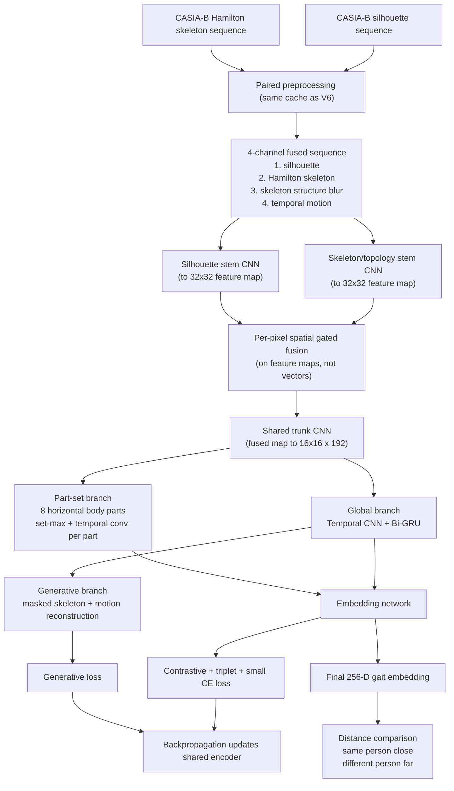

# Skeleton + Silhouette Part-Set Fusion V7: Model Architecture and Flow

This document explains the architecture, preprocessing pipeline, training flow, loss design, evaluation method, and final result of the `skeleton_silhouette_partset_v7` model.

V7 is the successor to V6 and is now the strongest design in this codebase (Tier A of `runs/MODEL_COMPARISON.md`). It was created from a specific diagnosis of V6's main representational bottleneck:

> V6 collapses each frame's spatial feature map into a single 192-D vector before any temporal modeling happens. That throws away *where on the body* a shape or motion difference occurs — but part-localized cues (head shape, torso lean, stride geometry) are exactly what separates visually similar subjects in strict Rank-1 retrieval.

V7 therefore keeps horizontal body-part features separate all the way through temporal aggregation (the same principle behind GaitSet, GaitPart, and GaitGL in the silhouette-gait literature), while deliberately keeping **everything else identical to V6** — the same 4-channel preprocessed cache, the same loss recipe, the same retrieval protocol, and the same optimizer/schedule hyperparameters. Because only the architecture changed, the V6 → V7 improvement is attributable to the architecture alone.

Like V6, the model is not a closed-set classifier at test time. Its final output is a 256-D embedding vector; recognition is done by comparing distances between embeddings.

## 1. Simple architecture diagram



## 2. What changed vs. V6, and why

| Aspect | V6 | V7 | Why |
|---|---|---|---|
| Stream fusion | Per-frame 192-D *vector* gate, after all spatial pooling | Per-pixel, per-channel gate on 32x32 feature maps | Fusion can now trust the skeleton in thin limb regions and the silhouette on the torso contour *within the same frame*; V6 had to make one whole-frame tradeoff. |
| Backbone | Two full independent backbones down to 8x8 | Two light stems to 32x32, then one shared trunk on the fused map to 16x16 | Early fusion + shared trunk spends parameters once instead of twice; V7 is actually smaller than V6 (6.20M vs 6.68M parameters). |
| Spatial identity cues | Destroyed before temporal modeling (global + 6-part avgpool -> one vector per frame) | Preserved: 8 horizontal part strips (avg+max pooled) survive into temporal aggregation | This is the core hypothesis. Identity lives in *where* on the body differences happen. |
| Temporal aggregation | Conv1d + Bi-GRU on holistic frame vectors only | Per part: set-max over time + a local temporal-conv branch, each part embedded by its own linear head; *plus* V6's Conv1d + Bi-GRU global branch | Set-max over time (GaitSet) captures each part's most discriminative appearance; the temporal conv adds short-range part motion (GaitGL); the surviving GRU keeps long-range dynamics and feeds the decoder. |
| Embedding input | attention + mean + max pooled GRU states + mean fused vector | 8 x 64-D part embeddings + attention + mean pooled GRU states | Part embeddings replace the max/structure pooling — they carry strictly more localized information. |
| Decoder | SkeletonDecoder on GRU states | Unchanged | The generative branch was working; no reason to touch it. |

Everything not listed above — losses, lambdas, masking, scheduler, learning rate, early-stopping policy, evaluation protocol, dataset cache — is byte-identical to V6's configuration.

## 3. Dataset and preprocessing

Identical to V6. V7 points at the exact same preprocessed cache:

```text
cache_dir: /data/processed/casia_b_skeleton_silhouette_fusion_v6
```

Four channels per frame (silhouette / Hamilton skeleton / structure blur / temporal motion), T = 30 uniformly sampled frames at 64x64, split at load time into:

```text
silhouette: B x 30 x 1 x 64 x 64
topology:   B x 30 x 3 x 64 x 64
```

See sections 3–4 of `designs/skeleton_silhouette_fusion_v6/MODEL_ARCHITECTURE_AND_FLOW.md` for the full preprocessing description — none of it changed.

## 4. Model components

### 4.1 Two light stream stems

Each stream (silhouette 1-channel, topology 3-channel) passes through a small stem:

```text
Conv2D(→32) -> BN -> SiLU
Conv2D(32→64, stride 2) -> BN -> SiLU
```

Output: a `64-channel, 32x32` feature map per frame, per stream. Unlike V6, the streams stay *spatial* here — no pooling yet.

### 4.2 Spatial gated fusion

The two 32x32 maps are fused with a learned per-pixel, per-channel gate:

```text
gate  = sigmoid(Conv1x1([silhouette_map, skeleton_map]))   # 64 channels, 32x32
fused = gate * skeleton_map + (1 - gate) * silhouette_map
```

This is V6's gating idea, moved from vector level to map level. The gate can emphasize the skeleton where thin-structure motion matters (legs, arms) and the silhouette where body contour matters (torso, head) — in the same frame.

### 4.3 Shared trunk

The fused map goes through one shared CNN trunk:

```text
Conv2D(64→96)            -> BN -> SiLU    # 32x32
Conv2D(96→128, stride 2) -> BN -> SiLU    # 16x16
Conv2D(128→160)          -> BN -> SiLU    # 16x16
Grouped Conv2D(160→192)  -> BN -> SiLU    # 16x16
```

Output: a `192-channel, 16x16` feature map per frame. The trunk deliberately stops at 16x16 (V6 went down to 8x8) so the part strips below have real vertical resolution to work with.

### 4.4 Part-set branch (the main new idea)

The 16x16 map is pooled into **8 horizontal body-part strips** (2 rows each), using average + max pooling summed:

```text
part features per frame: B x T x 8 parts x 192
```

Each part is then aggregated **over time, independently of the other parts**, by two complementary paths:

1. **Set-max pooling** — element-wise max over the 30 frames (GaitSet's insight: a part's most discriminative appearance across the sequence is a strong identity signature, regardless of when it happened).
2. **Local temporal convolution** — two grouped Conv1d layers (one dilated) over the time axis, shared across parts, followed by max over time. This captures short-range part *motion* (how the leg strip changes across a stride), which pure set-pooling ignores.

The two paths are summed, and each of the 8 parts is embedded by **its own linear head** (`SeparateFC`, 192 → 64), because "what makes a head discriminative" and "what makes a leg discriminative" are different functions:

```text
part embeddings: B x 8 x 64  ->  flattened to B x 512
```

### 4.5 Global temporal branch (kept from V6)

In parallel, the trunk's map is globally average-pooled to one 192-D vector per frame and processed exactly as in V6:

```text
Temporal CNN (grouped Conv1d) -> 2-layer Bi-GRU (hidden 176, bidirectional)
temporal sequence: B x T x 352
```

Pooled by attention + mean (V6's max pooling was dropped — the part branch's set-max supersedes it). This branch does two jobs: it contributes long-range gait dynamics to the embedding, and it feeds the reconstruction decoder.

### 4.6 Embedding, projection, classifier

```text
concat(part embeddings 512, attention pool 352, mean pool 352) = 1216
-> Linear -> LayerNorm -> GELU -> Dropout -> Linear -> BatchNorm
-> embedding: 256-D
```

The projection head (256 → 128, L2-normalized, for SupCon) and the small training-only auxiliary classifier are identical to V6.

### 4.7 Decoder

`SkeletonDecoder` is copied unchanged from V6: it reconstructs the masked Hamilton skeleton + motion channels from the GRU states. Its 18 parameter tensors only receive gradient on generative steps.

Total parameters: **6,203,429** (V6: 6,684,261 — V7 is slightly smaller despite the added part machinery, because the two full backbones merged into one shared trunk).

## 5. Generative and contrastive branches

Both are **byte-identical to V6** — same `compute_reconstruction_loss` (weighted BCE + Dice for skeleton, SmoothL1 for motion, masked frames only), same reconstruction target (skeleton + motion channels), same SupCon (`temperature 0.05`) + batch-hard triplet (`margin 0.35, lambda 1.6`) + small CE (`lambda 0.12, label smoothing 0.05`) recipe, same 30% frame masking, same warmup/interleave schedule (`generative_warmup_epochs 2`, `generative_step_interval 6`). See sections 6–8 of V6's flow document; every word applies here.

## 6. Training schedule

Identical config to V6's champion run:

```json
"epochs": 100,
"learning_rate": 0.00024,
"weight_decay": 0.00012,
"scheduler_name": "cosine",
"early_stopping_metric": "verification_auc",
"early_stopping_start_epoch": 12,
"early_stopping_patience": 24,
"eval_gallery_per_subject": 3
```

Rank-1 must be reported as **3-gallery Rank-1**, same as V6.

## 7. Result (`partset_rank1_001`)

Trained on Modal (`gait-datasets-store` volume, same CASIA-B cache as V6), early-stopped by verification-AUC patience after 87 epochs. All values below are real numbers from `runs/skeleton_silhouette_partset_v7/partset_rank1_001/metrics.jsonl`.

At the official best-Rank-1 epoch (epoch 86 — the checkpoint saved as `best_rank1_model.pt`):

```text
best Rank-1:            0.6791
Rank-5 there:           0.9131
verification AUC there: 0.9116
verification accuracy:  0.8330
distance gap there:     0.5892
```

The model's own best verification AUC (the `best_model.pt` checkpoint) was **0.9148 at epoch 62** (Rank-1 there 0.6648).

### Comparison with V6 (identical cache, protocol, and loss recipe)

| Metric | Fusion V6 (`fusion_rank1_002`) | Part-Set V7 (`partset_rank1_001`) | Delta |
|---|---:|---:|---:|
| Rank-1 (3-gallery) | 61.99% | **67.91%** | **+5.92 pp** |
| Rank-5 | 89.40% | **91.31%** | +1.91 pp |
| Verification AUC (at best-Rank-1 epoch) | 90.28% | **91.16%** | +0.88 pp |
| Own best verification AUC | 90.78% | **91.48%** | +0.70 pp |
| Distance gap | 0.559 | **0.589** | +0.030 |
| Parameters | 6.68M | **6.20M** | −0.48M |

V7 beats V6 on every metric with fewer parameters. Since the cache, losses, sampler, protocol, and schedule are identical, the entire improvement is attributable to the part-set architecture.

### An honest caveat

V7's best Rank-1 landed on its **final completed epoch (86)** — training was stopped by the verification-AUC patience (AUC had plateaued since epoch 62) while Rank-1 was still setting new highs. There may be additional Rank-1 headroom behind a longer patience or a Rank-1-aware stopping rule; the reported number is what the official early-stopping policy actually produced, not a tuned-after-the-fact pick.

## 7.5 CLoP-Gait custom dataset retraining (domain-generalization protocol)

V7 was also retrained on the self-collected `datasets/CLoP-Gait` dataset
under the exact protocol used for V6's Tier C run: same corrected
preprocessed cache, same domain-generalization split
(`GaitSequenceDataset(split_mode="domain")` — all 5 subjects' indoor +
outdoor-night sequences train; their outdoor-day sequences are the entire
test set), same hyperparameters. Config:
`designs/skeleton_silhouette_partset_v7/clopgait_config.json` (byte-identical
to V6's CLoP-Gait config apart from the design name injected at submit time).
`num_classes` is 5 on this dataset, so only the auxiliary classifier head's
shape differs from the CASIA-B run.

Result (`clopgait_domain_split_001`, real numbers from `metrics.jsonl`,
reproduced exactly by local checkpoint re-evaluation):

```text
epochs (stopped):   61
best Rank-1:        0.8261  (epoch 36; 38 of 46 probes)
Rank-5 there:       1.0000
verification AUC:   0.8277  (best AUC and best Rank-1 landed on the same epoch)
distance gap:       0.6934
normal-condition Rank-1:   0.9545  (22 probes)
clothing-condition Rank-1: 0.7083  (24 probes)
```

Comparison with V6's CLoP-Gait run (`clopgait_domain_split_002`: Rank-1
86.96%, AUC 81.55% at that epoch, gap 0.616): the test pool is only 46
probe sequences over 4 subjects, so V6's nominal +2-probe Rank-1 edge and
V7's nominal AUC/distance-gap edge are both **inside noise — this dataset
cannot rank the two architectures**. The statistically meaningful
architecture comparison is Tier A's CASIA-B protocol (1,047 probes),
where V7 wins on every metric (section 7). What this run establishes is
that V7 transfers to the custom-dataset, unseen-environment task without
degradation. Full graphs and per-condition CSVs:
`runs/skeleton_silhouette_partset_v7/clopgait_domain_split_001/post_training_analysis/`.

## 8. Evaluation flow and metrics

Identical to V6 (sections 10–11 of its flow document): embeddings compared by cosine distance; Rank-1/Rank-5 via 3-gallery retrieval over the 50 held-out subjects; verification AUC/accuracy and distance gap from all same/different pairs.

## 9. Practical run command

```bash
modal deploy modal_app.py
python submit_modal.py run --design skeleton_silhouette_partset_v7 --run partset_rank1_002
```

(Never reuse a run name for a different trial.)

## 10. Files related to V7

```text
designs/skeleton_silhouette_partset_v7/config.json
designs/skeleton_silhouette_partset_v7/clopgait_config.json     (CLoP-Gait overrides, section 7.5)
designs/skeleton_silhouette_partset_v7/model.py
designs/skeleton_silhouette_partset_v7/README.md
designs/skeleton_silhouette_partset_v7/MODEL_ARCHITECTURE_AND_FLOW.md
runs/skeleton_silhouette_partset_v7/partset_rank1_001/          (CASIA-B run artifacts + analysis)
runs/skeleton_silhouette_partset_v7/clopgait_domain_split_001/  (CLoP-Gait run artifacts + analysis)
```

Shared training and preprocessing code (unchanged by V7):

```text
gait/preprocessing.py
gait/dataset.py
gait/train.py
gait/losses.py
gait/config.py
```
